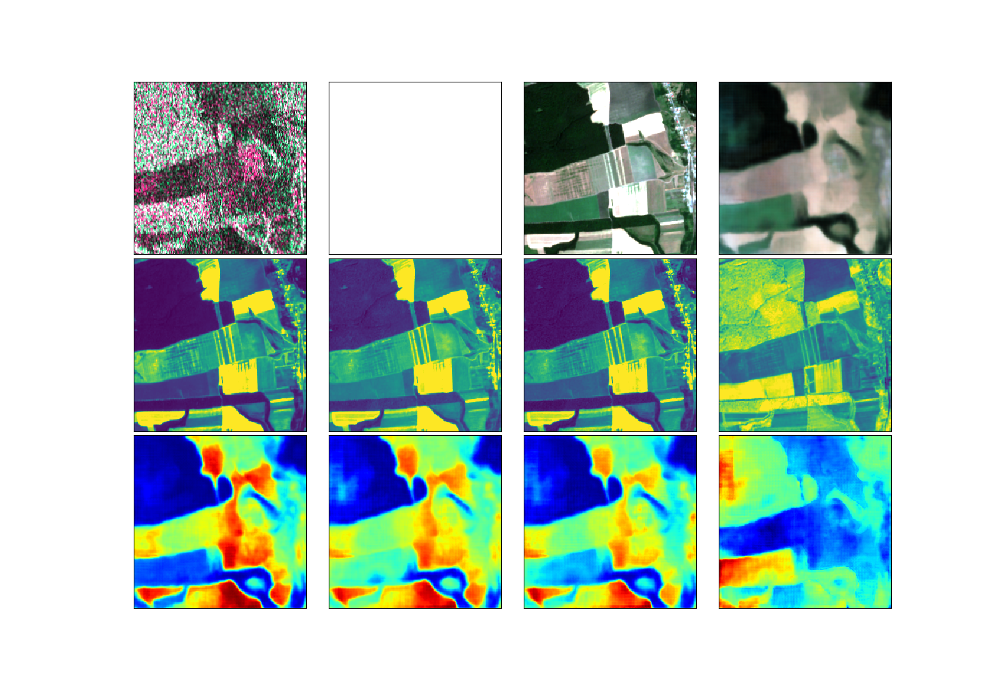

### DeepSAR

**SAR classification with unsupervised optical domain transfer**



### About

This project classifies SAR imagery using unsupervised optical transfer.

The [network](/model) is a U-NET encoder-decoder learning unsupervised optical domain over SAR imagery.

### Results

Inference [results](/infer) on ESA Sentinel1 SAR images.

### Authors

 * **Balint Cristian** ```<cristian dot balint at gmail dot com>```
